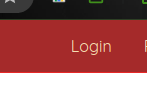
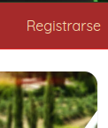
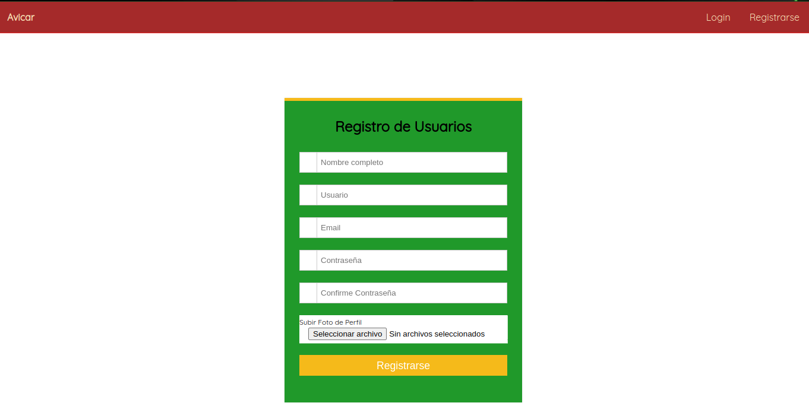

# **Manual Tecnico**

## Tecnologias usudas
* Angular Version 18
* Nodejs version 20
* MongoDB
* Docker version 26

## Requitos 
* npm
* nodejs
* docker

## Funciones Importantes

### registrar()
Esta funcion del frontend nos sirve para registrar un usuario en la base
de datos. Verifica que todos los datos esten correctos. 

`
registrar(){
      if(this.form_registro.valid){
        if(this.form_registro.value.password === this.form_registro.value.confirm_password){
          const index = this.imagen_path.indexOf(",");
          this.imagen_path = this.imagen_path.slice(index + 1);
          this.form_registro.value.imagen = this.imagen_path;
          this.form_registro.value.path= this.imagen.name;
          console.log(this.form_registro.value);
          this.http.consult_post('/admin/registro', this.form_registro.value).subscribe({
            next: (data:any)=>{
              if(data){
                console.log('Usuario Registrado');
                console.log(data.image);
                this.ruta_aws = data.image;
                Swal.fire({
                  title: 'Usuario Registrado',
                  text: 'Usuario Registrado correctamente', 
                  icon: 'success',
                  confirmButtonText: 'Aceptar'
                });
                //this.router.navigateByUrl('/admin');
              }else{
                Swal.fire({
                  title: 'Error al registrar usuario',
                  text: 'Error al registrar usuario',
                  icon: 'error',
                  confirmButtonText: 'Aceptar'
                });
                console.log('Error al registrar usuario');
              }
            },
            error: (error:any)=>{
              console.log(error);
              Swal.fire({
                title: 'Error al registrar usuario',
                text: 'La base de datos no responde :c',
                icon: 'error',
                confirmButtonText: 'Aceptar'
              });
              console.log('Error al registrar usuario');
            }
          });
        }else{
          alert('Las contraseñas no coinciden');
          console.log('Las contraseñas no coinciden');
        }
      }else{
        alert('Formulario incompleto');
        console.log('Formulario incompleto');
      }
    }
`

### Submit
Esta funcion se encarga de la verficación de los datos para
que el usuario pueda ingresar a su cuenta

`
        submit(){
        if(this.loginForm.valid){
            console.log(this.loginForm.value);
            this.http.consult_post("/admin/login", this.loginForm.value).subscribe({
                next:(data:any)=>{
                    if(data){
                        if(data.isAdmin){
                            this.router.navigateByUrl('/admin');
                        }else{
                            //aca van los otros usuarios
                            
                        }
                    }else{
                        swal.fire({
                            title: 'Error en los datos',
                            text: 'El usuario o contraseña son incorrectos',
                            icon: 'error',
                            confirmButtonText: 'Aceptar'
                          });
                    }
                },
                error: (error:any)=>{
                    console.log(error);
                    swal.fire({
                        title: 'Error al Ingresar',
                        text: 'El usuario o contraseña son incorrectos',
                        icon: 'error',
                        confirmButtonText: 'Aceptar'
                      });
                }
            });
        }
    }
`

# **Manual de Usuario**

## Pagina principal 

## Login
En este apartado podemos encontrar la pagina para acceder al sitio 

## Pagina para acceder al sistema
Se debe ingresar sus datos para poder acceder

## Registro 
En caso de no tener cuenta, puede registrarse en el apartado de "Registrarse" en la pagina principal

Solo debe llenar el formulario y estara registrado

